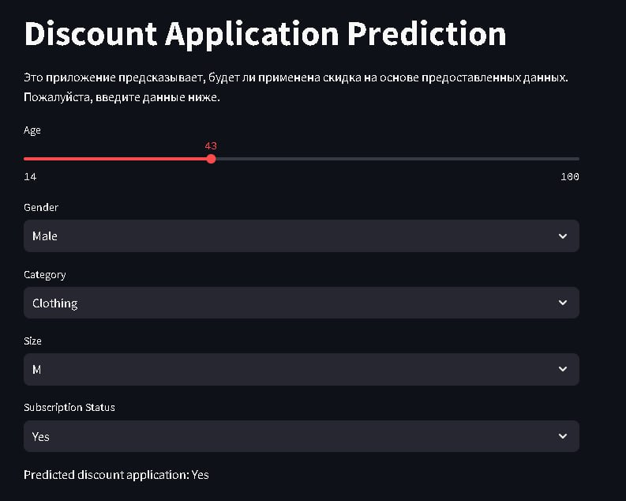

# Discount Application Prediction
This application is designed to manage an internet shop by predicting whether a potential customer will use the offered discount or not. It can also be used by customers.

# Overview
The essence of the application lies in predicting whether a potential customer will utilize a provided discount or not. It is deployed using Streamlit and developed in Python. The underlying model is based on Random Forest.

# Features
## Prediction Criteria: 
The model predicts based on various criteria such as the age and gender of the customer, their interests in product categories ("Clothing", "Accessories", "Footwear", "Outerwear"), preferred clothing size ("M", "L", "S", "XL"), and whether they are subscribed to the shop's newsletters.

## User Interaction: 
Users of the application are required to fill in the specified fields to obtain predictions.

# Model Quality
The quality of the model is assessed using the f1 metric, ensuring reliability and accuracy in predictions.

# Usage
Ensure Python is installed on your system.
Install the required dependencies by running pip install -r requirements.txt.
Run the application using Streamlit by executing streamlit run app.py in the terminal.
Fill in the required fields with customer information to obtain predictions.
Contact
For any inquiries or support, please contact email@example.com.

# Acknowledgements
Special thanks to the contributors and developers involved in building this application.

# License
This project is licensed under the MIT License - see the LICENSE file for details.

# Demonstration of work

